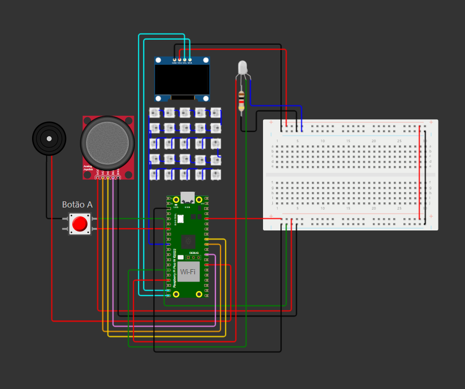
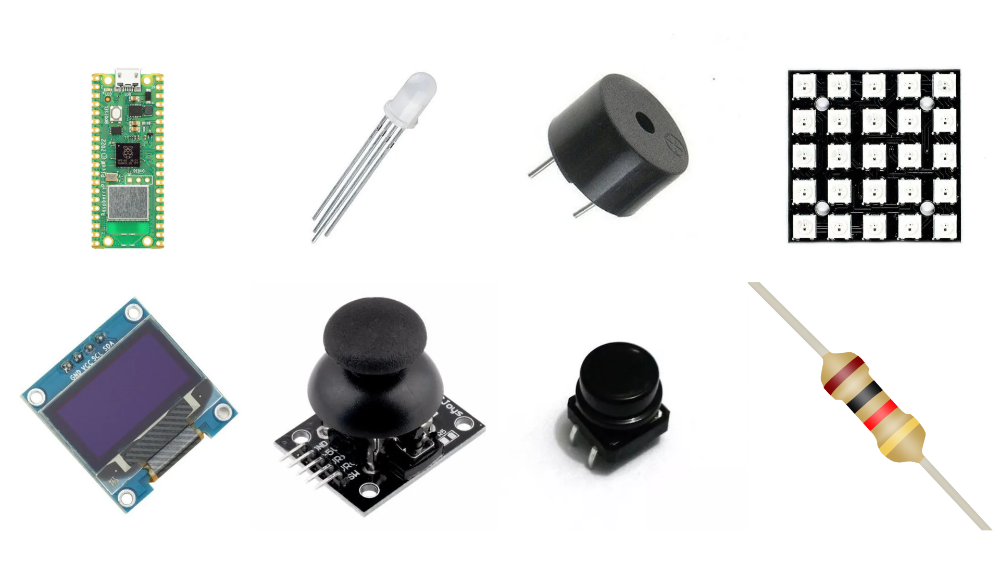
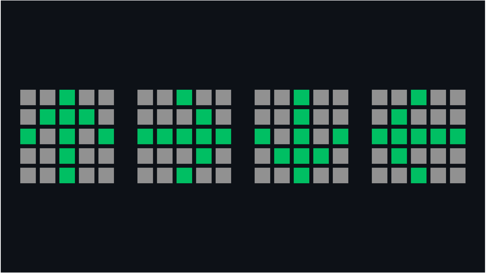

  <h1>Descrição do projeto:</h1>

  O jogo começa quando o usuário pressiona o botão "A", indicando que está pronto para jogar. Em seguida, uma seta é exibida na matriz de LEDs 5x5, apontando para uma das quatro direções possíveis: direita, esquerda, cima ou baixo. O jogador deve então mover o joystick na direção correspondente.

Se a resposta estiver correta, uma nova direção aleatória é adicionada à sequência. A cada rodada, a sequência completa é exibida novamente para que o jogador a memorize e a reproduza corretamente. O jogo continua até que o jogador cometa um erro ou alcance o round 100, momento em que é finalizado.

Caso o jogador erre, ele recebe um aviso na tela OLED e pode reiniciar a partida pressionando o botão "A" novamente.

 

 

  <h2>Esquemático:</h2>
  

  Simulação no Wokwi: <a href="https://wokwi.com/projects/421294906683841537" target="_blank">Link</a>
   
  OBS: a sequência de setas no Wokwi será sempre a mesma no início do jogo, pois a função <code>random()</code> se baseia no tempo de processamento, e o simulador sempre inicia com o mesmo tempo, resultando na mesma sequência aleatória.

  <h2>Materiais Utilizados:</h2>
    

 
<ul>
  <li>
    Microcontrolador RP2040 da Raspberry Pi Pico W
  </li>
  <li>
    Led RGB catodo comum 5mm
  </li>
  <li>
    Resistor de 1kΩ
  </li>
  <li>
    Buzzer Passivo
  </li>
  <li>
    Display OLED 128x64 - 0.96 Polegadas I2C
  </li>
  <li>
     Módulo 5x5 Leds RGB WS2812B 5050
  </li>
  <li>
    Chave Táctil Push Button - Botão 12x12x7.5 mm
  </li>
  <li>
    KY023 joystick analógico
  </li>
</ul>

 

  <h2>Saídas Possíveis da Matriz de LEDs 5x5:</h2>
    

 

  <h2>Possíveis Melhorias Futuras:</h2>
  

Para tornar o jogo mais desafiador, podemos adicionar novas funcionalidades que envolvem a interação com as cores das setas. Uma possível melhoria seria a introdução de uma seta vermelha, que indicaria uma direção proibida para o usuário. Assim, ele deveria escolher uma das outras três direções disponíveis, exceto a que foi sorteada e exibida em vermelho.
  
Além disso, as setas verdes, como no sistema atual, continuariam indicando a direção correta, exigindo que o usuário responda adequadamente. No entanto, as setas azuis trariam um novo desafio: o usuário precisaria escolher a direção oposta à indicada. Por exemplo, se a seta azul apontasse para a direita, a resposta correta seria para a esquerda.
  
Essa alteração tornaria o jogo mais complexo, pois o usuário precisaria não apenas memorizar as direções, mas também associar cada cor a uma ação específica. Com isso, a dificuldade de memorização aumentaria, desafiando ainda mais o jogador a prestar atenção tanto nas direções quanto nas cores das setas, criando uma experiência de jogo mais envolvente e dinâmica.
